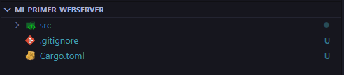
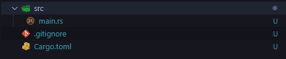
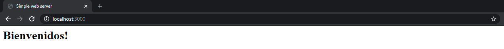

## Empezamos

Hoy vamos a aprender a como crear un simple webserver en Rust que nos retorne un html muy simple.

En las siguientes partes, veremos como meterle enrutamiento para poder hacer una api. Manos a la obra!

## Primer paso:

Primero de todo ejecutamos por terminal:

`embed:cargo-new.sh`

Cuando finalice la ejecución del comando el resultado de la consola debe ser el siguiente:
`embed:output-cargo-new.sh`

Este comando lo que ha hecho a sido crearnos un binario ejecutable de un hola mundo en Rust.

Como ya sabemos cargo es el gestor de paquetes de Rust. El ```new ``` es como le indicamos que queremos crear un nuevo proyecto.

El ```--bin``` es para indicarle que queremos que el nuevo proyecto sea un binario ejecutable y por último, le pasamos como parámetro el nombre del proyecto, en este caso, mi-primer-webserver.

## Abrimos nuestro editor preferido!

Yo como editor para programar uso Visual Studio Code (VsCode), más info en este [link](https://code.visualstudio.com/).

Ahora veamos que nos ha creado el comando anterior!



Vemos que lo que nos ha creado es una estructura en la que tenemos un .gitignore, una carpeta source y el fichero Cargo.toml.

Para quién no sepa para qué sirve el fichero Cargo.toml le recomiendo que lea la primera entrada de mi post [¿Por qué Rust?](./../por-que-rust/) Donde aclaro estas cosas.

Ahora veamos que hay dentro de la carpeta source:



Como podemos observar solo hay un fichero, con la extensión .rs que es la extensión de los ficheros de Rust. Es un fichero que simplemente contiene un *"Hola Mundo"*.

```rust
fn main() {
    println!("Hello, world!");
}
```

## Una vez explicado todo esto, pongámonos manos a la obra 👨‍💻

Lo primero que vamos a hacer, es añadir las dependencias que necesitamos a nuestro proyecto.

Vamos a necesitar:
- [Iron](https://github.com/iron/iron): nos permite crear un pequeño webserver, api RESTful con bastante facilidad.

Como ya expliqué en mi anterior [post](./../por-que-rust/), las dependencias van situados en el Cargo.toml. Quedan de la siguiente manera.


```toml
[package]
name = "mi-primer-webserver"
version = "0.1.0"
authors = [
    "Leos1113"
]
edition = "2018"

[dependencies]
iron = "0.6.1"
```

Cada línea de dependencies es el nombre de un crate (un paquete) de [crates.io](https://crates.io/) y la versión que vamos a utilizar.

Como podéis observar le estoy poniendo una versión fija a la dependencia/paquete, esto es para hacer que nuestro código siga funcionando aunque haya updates de estas dependencias, ya que siempre vamos a utilizar la misma y no habrá cambios que nos rompan la applicación.

Si ponemos:

```toml
[dependencies]
iron = "*"
```

Siempre nos buscará la versión más nueva de esta dependencia, entonces pueden haber errores en nuestro código ya que al buscar siempre una versión nueva puede haber incompatibilidades con nuestro código hecho en versión.

Como veis solo listamos los paquetes que vamos a usar directamente, cargo se encarga de descargar las dependencias de estos paquetes sin que nosotros nos tengamos que preocupar por ellas.

## Y ahora a por el código! Abrimos el fichero main.rs
`embed:main.rs`

Ahora vemos que hay muchas cosas, vamos a ver qué hacen/para que sirven, no os preocupeis si no se entiende nada de primeras, es normal😋

Vamos linea por linea.

```rust
extern crate iron
```
Esto lo que hace es importar el crate que hemos descargado al ponerlo en el fichero de dependencias y nos permite utilizarlo.

Las siguientes tres líneas, simplemente sirve para no tener que escribir todo el rato
```rust
Iron::mime::Mime
```
Simplemente nos simplifica la manera de escribirlos repetidamente, si conocéis C++, tiene el mismo funcionamiento que cuando hacemos un namespace, o igual que cuando lo hacemos en php.

Todo fichero main.rs necesita una funcion main para funcionar, en Rust declaramos las funciones como podemos observar en la captura, con la nomenclatura fn y seguidamente nombre de la función.

No quiero entrar en detalle en todo, doy por hecho que tenemos una bases de programación ya afianzadas, por eso voy a ir un poco por encima en estas cosas, que doy ya por sabidas.

La siguiente línea simplemente imprime por consola el texto que contiene.

Ahora llegamos a lo interesante. Creamos una nueva instancia de Iron que recibe una función que crearemos más abajo, seguidamente, en el http le indicamos que corra en localhost en el puerto 3000, en mi caso le he puesto este porque me convenía, pero puede ser el 8080 por ejemplo. También si ponemos https acepta un https, pero para el ejemplo no lo veía necesario. Y hacemos un unwrap que nos devolverá error si algo no ha ido bien, si no, simplemente ya tendremos nuestra instancia de iron levantada.

Pasamos a la función get\_welcome (las funciones en Rust por convenio van en snake_case, más info en el [link](https://doc.rust-lang.org/1.0.0/style/style/naming/README.html)) que tiene como parámetros una Request.

Después viene la declaración de una variable response, donde simplemente instanciamos un nuevo Objeto Response.

Ahora quiero hacer inciso en la palabra mut, las variables/parámetros en Rust son inmutables, esto quiere decir que no se les puede cambiar el valor, parecido a los const de javascript, entonces si no le ponemos el mut, no podremos cambiarles el valor.

La siguiente variable 
```rust
content_type
```
Es simplemente para indicarle que vamos a enviar un trozo de html como respuesta.

Ahora pasamos a setear la respuesta en el header, en este caso un 200, es simplemente un ejemplo, no siempre hay que mandar un 200. Un status 200 es para indicar que todo ha ido bien.

Seteamos también el contenido en el header, con la variable que hemos creado anteriormente.

Y por último, le seteamos la respuesta, en este caso un ```<title>``` para la pestaña del navegador y un ```<h1>``` que pone Bienvenidos!

Por último usamos la funcion Ok con la response dentro para que se lo que se envie cuando llegue una petición.

## Ahora solo nos queda comprobar si todo ha funcionado bien! ✅

Ejecutamos por consola 
```bash
cargo run
```
Cuando acabe de compilar nos saldrá algo como esto "Servidor escuchando en http://localhost:3000..."

Y si introducimos en nuestro navegador http://localhost:3000 veremos lo siguiente:



Eso es todo por hoy! Hemos creado un webserver que nos devuelve un html en Rust! En el siguiente post, le añadiremos más rutas, para hacer un pequeño CRUD.

Espero que os haya gustado, hasta el siguiente post 😁

